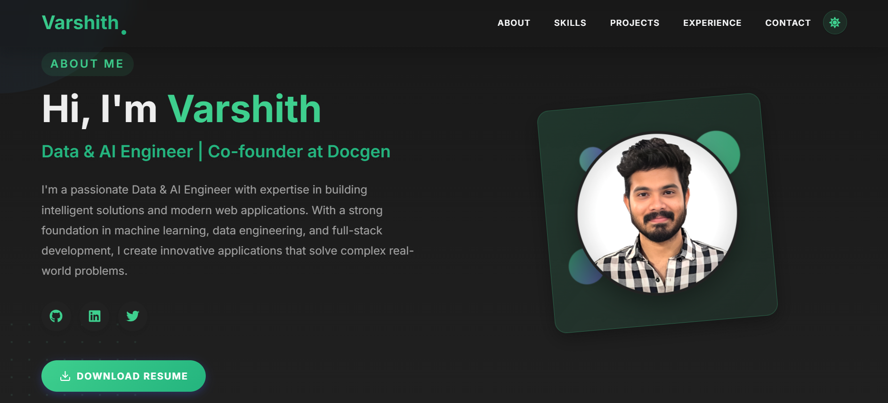

# Varshith Gudur - Professional Portfolio



A modern, responsive portfolio website showcasing my skills, projects, and professional experience as a Data & AI Engineer. Built with React, TypeScript, and Vite.
If you like the project fork the project and follow me 

## 🌟 Live Demo

Visit the live website: [https://varshith-gudur-portfolio.vercel.app/](https://varshith-gudur-portfolio.vercel.app/)

## ✨ Features

- **Responsive Design**: Fully optimized for all devices (desktop, tablet, and mobile)
- **Dark/Light Mode**: Toggle between dark and light themes with Supabase-inspired color scheme
- **GitHub Integration**: Dynamically fetches and displays projects from GitHub
- **Modern UI**: Glassmorphism effects, smooth animations, and interactive elements
- **Performance Optimized**: Fast loading times and smooth scrolling experience
- **Accessibility Focused**: Designed with accessibility in mind
- **SEO Friendly**: Optimized meta tags for better search engine visibility

## 🛠️ Technologies Used

- **Frontend**: React, TypeScript, Framer Motion
- **Styling**: CSS with custom properties for theming
- **Build Tool**: Vite
- **Deployment**: Vercel
- **Version Control**: Git & GitHub
- **Package Manager**: npm

## 📋 Project Structure

```
portfolio/
├── public/             # Static assets
│   ├── images/         # Image assets
│   └── favicon/        # Favicon files
├── src/
│   ├── components/     # React components
│   ├── context/        # React context providers
│   ├── data/           # JSON data files
│   ├── services/       # API services
│   ├── App.css         # Main stylesheet
│   ├── App.tsx         # Main App component
│   ├── index.css       # Global styles
│   └── main.tsx        # Entry point
├── index.html          # HTML template
├── package.json        # Dependencies and scripts
├── tsconfig.json       # TypeScript configuration
└── vite.config.ts      # Vite configuration
```

## 🚀 Getting Started

### Prerequisites

- Node.js (v14.0.0 or later)
- npm (v6.0.0 or later)

### Installation

1. Clone the repository:
   ```bash
   git clone https://github.com/varshith-Git/portfolio.git
   cd portfolio
   ```

2. Install dependencies:
   ```bash
   npm install
   ```

3. Start the development server:
   ```bash
   npm run dev
   ```

4. Open your browser and visit:
   ```
   http://localhost:5173
   ```

## 🔧 Available Scripts

- **Development**: `npm run dev` - Starts the development server
- **Build**: `npm run build` - Builds the app for production
- **Preview**: `npm run preview` - Previews the production build locally
- **Lint**: `npm run lint` - Runs ESLint to check code quality

## 📱 Responsive Design

The portfolio is fully responsive and optimized for:
- Desktop (1200px and above)
- Tablet (768px to 1199px)
- Mobile (below 768px)

## 🎨 Customization

You can easily customize the portfolio by modifying the data in the `src/data/portfolio.json` file. This includes:

- Personal information
- Skills and expertise
- Work experience
- Projects (in addition to GitHub projects)
- Contact information

## 📄 License

This project is licensed under the MIT License - see the [LICENSE](LICENSE) file for details.

## 📞 Contact

Varshith Gudur - [LinkedIn](https://www.linkedin.com/in/varshithg17/) - [Email](mailto:varshith.gudur17@gmail.com)

Project Link: [https://github.com/varshith-Git/portfolio](https://github.com/varshith-Git/portfolio)

---

⭐️ If you found this project helpful, please consider giving it a star on GitHub! ⭐️
